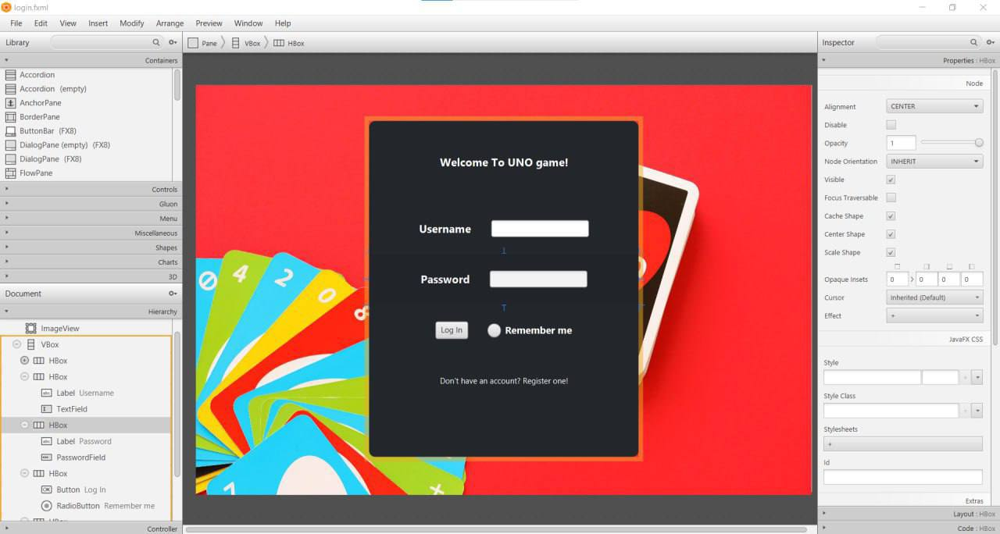
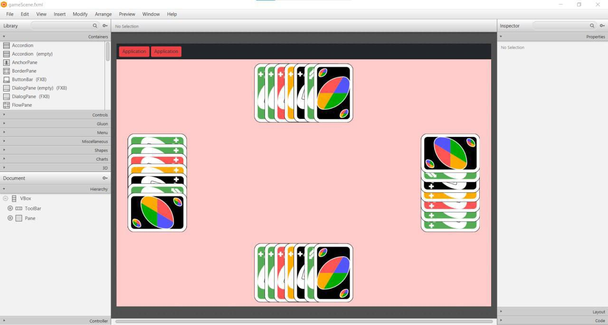

# UNO Game in Java

A simple, single‐player UNO card game built with Java and JavaFX.  
Explore the classic gameplay of UNO, complete with a login screen and an interactive game table.

---

## 📸 Preview

Login screen:  


Game screen:  


---

## 🚀 Features

- **User Authentication**  
  A basic JavaFX‐powered login form (with “Remember me” support).

- **UNO Gameplay**  
  Draw, play, and match cards by color or number, including special action cards (Skip, Reverse, Draw Two, Wild, etc.).

- **UI Layout**  
  Built with FXML:  
  - `login.fxml` for the login panel  
  - `gameScene.fxml` for the card table  

- **Modular Codebase**  
  Includes core classes like `Card`, `Deck`, `Player`, and `GameEngine` packaged inside `FinalProjectAP.rar`.

---

## 🛠️ Built With

- **Java 8+**  
- **JavaFX** for UI  
- **FXML** for layout  
- **Maven** (optional) or manual compilation

---

## ⚙️ Getting Started

1. **Clone the repo**  
   ```bash
   git clone https://github.com/Pouya-Ta/UNO-Game-using-java.git
   cd UNO-Game-using-java
